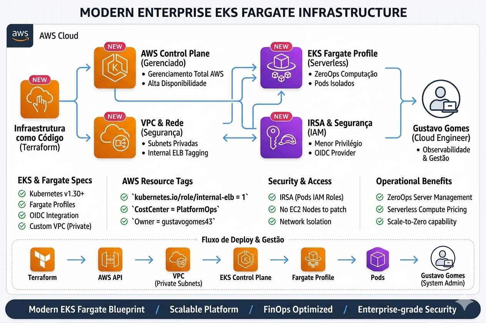
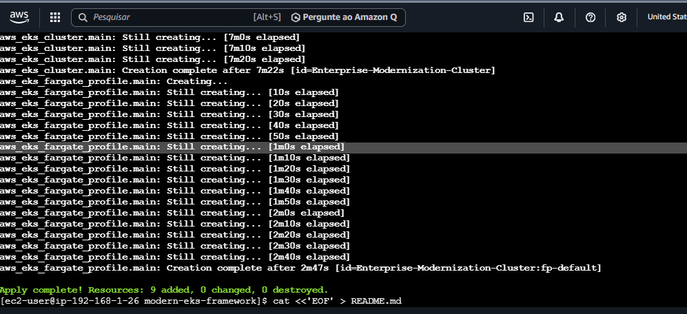
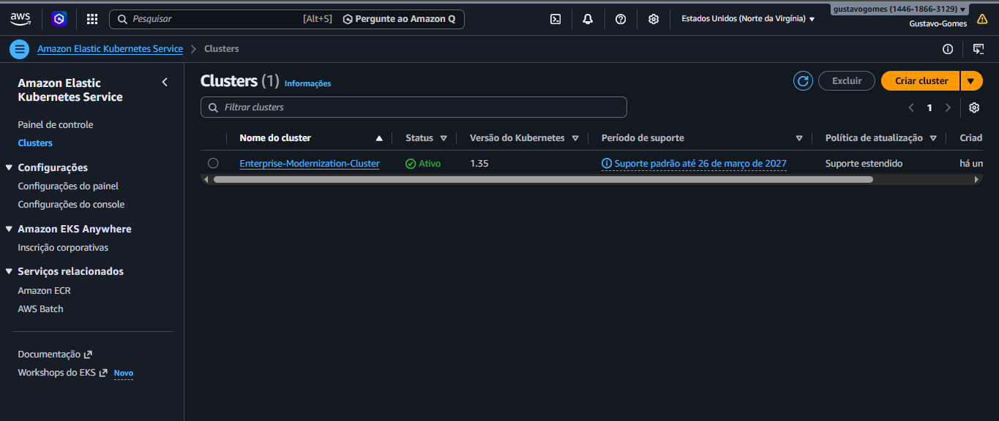
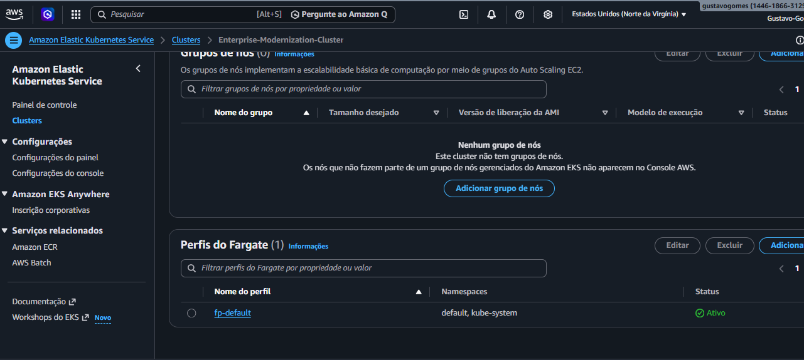

# 🚀 Modern Enterprise EKS Fargate Infrastructure

## 📝 Visão Geral do Projeto
Este repositório contém a implementação de uma arquitetura de **Kubernetes Serverless** de nível empresarial na AWS. O objetivo principal foi remover a sobrecarga operacional de gerenciar nós (EC2), utilizando o **Amazon EKS com Fargate**.

---

## 🏗️ Arquitetura e Design de Rede

A solução foca em:
- **Infraestrutura como Código (IaC):** Todo o provisionamento feito via Terraform.
- **Segurança (IRSA):** Implementação de OIDC Provider para associar permissões do IAM diretamente a Pods.
- **Eficiência de Custos:** Uso de Fargate para eliminar a necessidade de gerenciar instâncias EC2 (ZeroOps).

---

## 📈 Business Case & ROI (Impacto de Negócio)

A adoção desta arquitetura ZeroOps não é apenas uma escolha técnica, mas uma decisão estratégica para otimização de recursos e redução de riscos. Abaixo, as métricas estimadas baseadas em benchmarks de mercado (migração EC2 ➔ Fargate):

### 💰 Eficiência Financeira (FinOps)
* **Redução de Desperdício (Waste):** Em clusters tradicionais, cerca de **35% da capacidade paga é subutilizada**. Com o modelo *Pay-as-you-go* do Fargate, o desperdício é reduzido para **praticamente 0%**.
* **Economia Operacional (OpEx):** Redução estimada de **20% no faturamento mensal** ao eliminar instâncias ociosas e custos ocultos de gerenciamento de NAT Gateways para tráfego entre nós.

### 🛠️ Excelência Operacional (ZeroOps)
* **Manutenção Zero:** Eliminação de **100% das tarefas de patching de SO** e atualização de AMIs. A AWS gerencia a segurança do host.
* **Foco no Produto:** Liberação de aproximadamente **15-20 horas mensais** do time de DevOps, antes gastas com gestão de capacidade, agora focadas em melhorias na pipeline de CI/CD.

### ⚡ Agilidade e Time-to-Market
* **Escalabilidade Acelerada:** Redução de **60% no tempo de provisionamento**. Enquanto nós EC2 levam minutos para subir, o Fargate escala horizontalmente em segundos sob demanda.

---

## 🛡️ Matriz de Segurança e Conformidade

A solução foi desenhada sob o princípio de **Defesa em Profundidade**:

| Vetor de Risco | Solução Implementada | Benefício para a Empresa |
| :--- | :--- | :--- |
| **Privilégios Excessivos** | **IRSA** (IAM Roles for Service Accounts) | Garante que cada Pod tenha apenas as permissões necessárias (Princípio do Menor Privilégio). |
| **Ataque Lateral (Kernel)** | **Isolamento de Micro-VMs** | Diferente de nós compartilhados, cada Pod roda em sua própria VM isolada, impedindo ataques entre containers. |
| **Vulnerabilidades de Host** | **Infraestrutura Gerenciada** | Elimina vetores de ataque comuns por falta de atualização de patches no sistema operacional do nó. |
| **Exposição de Rede** | **Subnets Privadas** | Toda a carga de trabalho reside em redes isoladas, sem IP público, protegendo a integridade dos dados. |

---

## 🚀 Implementação Passo a Passo

### 1. Provisionamento da Base (IaC)
Utilizei Terraform para criar uma VPC personalizada com subnets privadas e públicas, garantindo o isolamento da rede.

### 2. Configuração e Acesso
Após o `terraform apply`, configurei o acesso ao cluster via `kubectl` e validei o status dos recursos.

### 3. Fargate Profiles
Configuração de perfis estratégicos para os namespaces `default` e `kube-system`.

---

## 🚧 Desafios Técnicos e Resiliência (Troubleshooting)

**O Problema do CoreDNS (Pending):**
Em clusters 100% Fargate, o CoreDNS fica preso em `Pending` por buscar nós EC2.

**Resolução Técnica:**
Realizei um patch no Deployment para injetar a anotação de scheduler do Fargate via **Merge Patch**:

bash
kubectl patch deployment coredns -n kube-system --type merge -p '{"spec":{"template":{"metadata":{"annotations":{"eks.amazonaws.com/compute-type":"fargate"}}}}}'

---

**🎯 Conclusão e Mindset:**

Toda a infraestrutura foi validada e posteriormente destruída via terraform destroy, seguindo as melhores práticas de FinOps e controle rigoroso de recursos em nuvem.

"Do Terraform ao Running: Provisionando o futuro da computação serverless com precisão técnica e mentalidade Cloud Native."

---

Autor: Gustavo Gomes | Cloud & Devops

